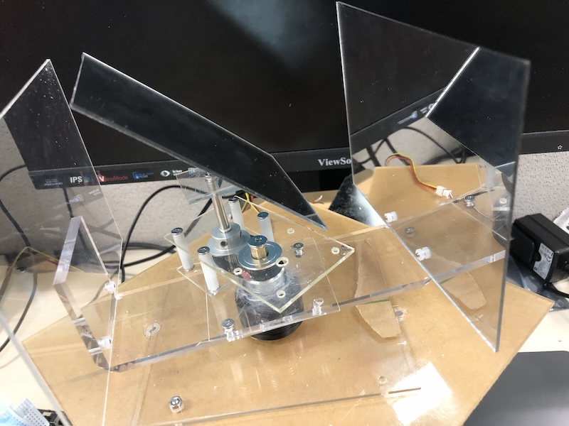
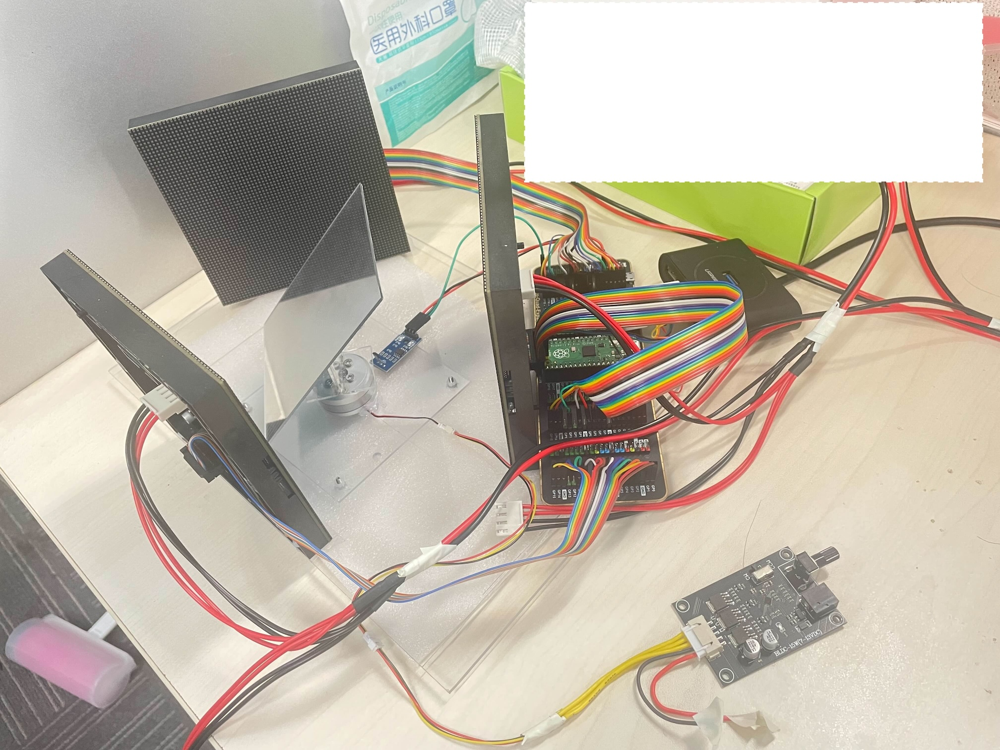
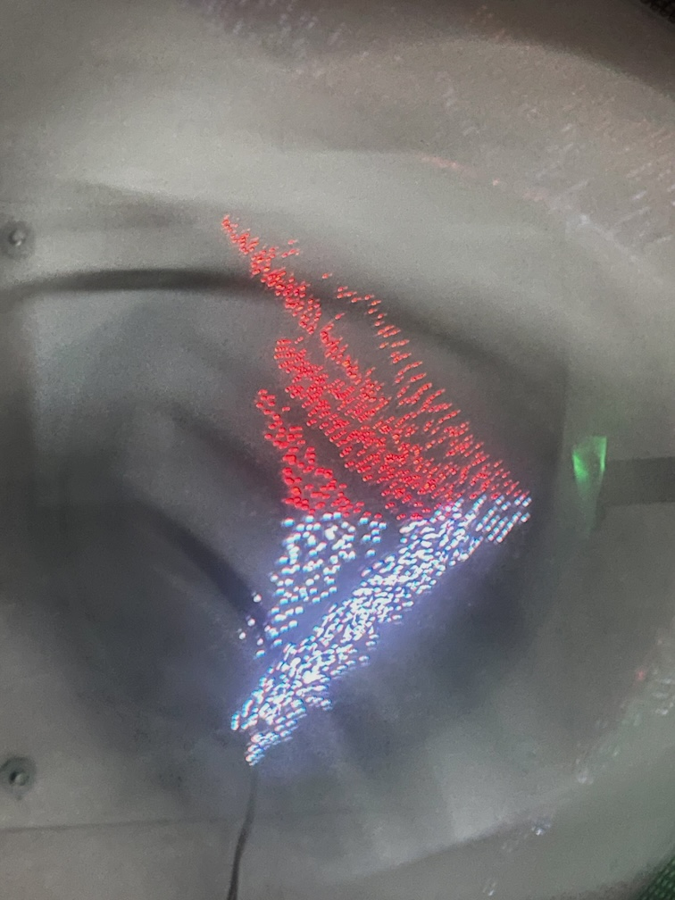
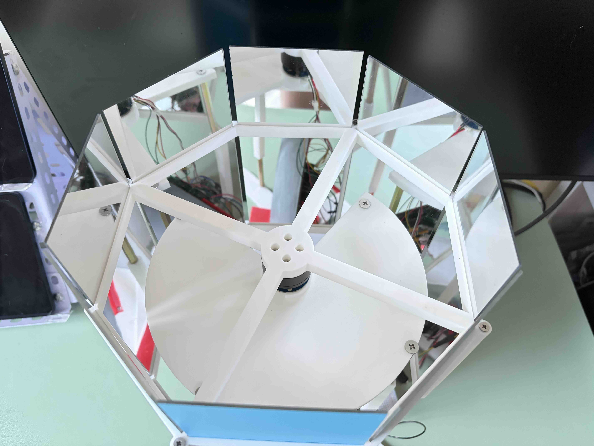

# vdrm

hackaday: https://hackaday.io/project/194714-volumetric-display-using-rotating-mirror

## Volumetric Display using Rotating Mirror(early stage)
An idea of Volumetric Display by changing the optical path with two spinning mirrors

## version 2.0

version 2.0 demo hardware with one mirror and three surrouding led screens

showing a half pyramid

## version 3.0

version 3.0 demo hardware 

Video: https://www.youtube.com/watch?v=ltCB7yHVI58 (showing a car)

Video: https://www.youtube.com/shorts/buwWeIkI5tU (some simple 3d models)
