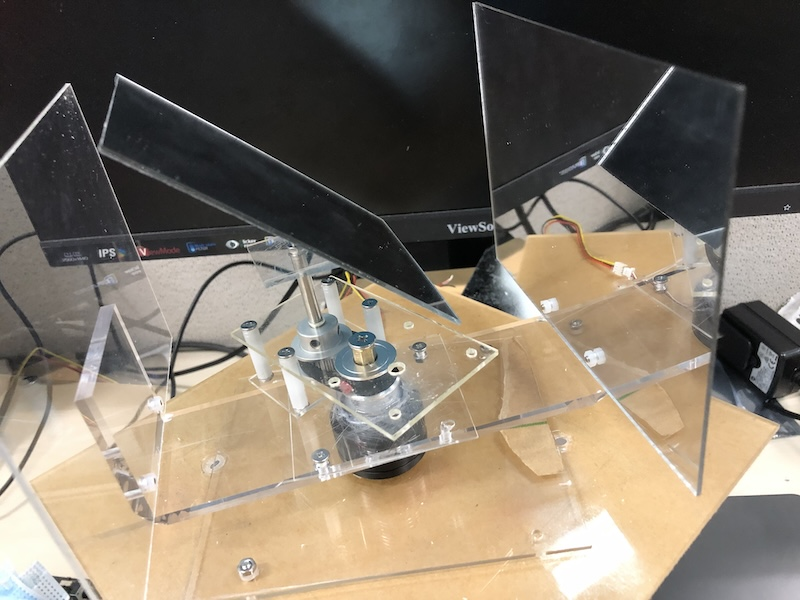

# vdrm
## Volumetric Display using Rotating Mirror(early stage)
An idea of Volumetric Display by changing the optical path with two spinning mirrors

The location of the rotating 45° mirror 10 is fixed. The vertical mirror 9(can also be replaced with a led screen) is doing the circular motion, always facing the 45° mirror with the same angular velocity. When watching from the top, the optical path from transparent screen 11 to eye is periodically changed.

Video: https://youtube.com/shorts/WtBLADxNRh4

Video: https://www.youtube.com/shorts/ZilCZabeLMg (debuging with single mirror and led)

Video: https://www.youtube.com/shorts/ft3zD9OViyE (debuging with two mirrors and led)

Video: https://www.youtube.com/shorts/52YA3tK1XmA (debuging with single mirror and led, showing a volumetric Aescartes Heart Curve.)
